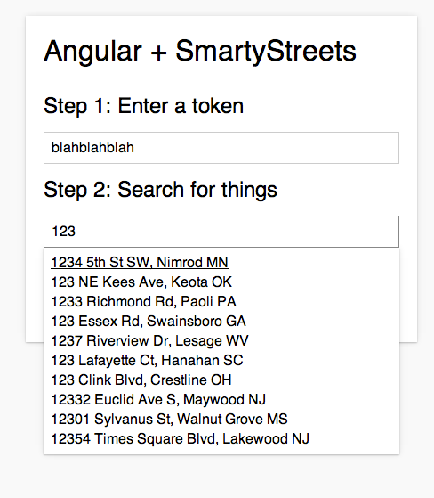

angular-liveaddress
===================

Use SmartyStreets to autocomplete address fields in an [angularjs](https://angularjs.org/) module. [Try it out.](http://faradayio.github.io/angular-liveaddress/)



Returns location JSON:
```JSON
{
  "input_index": 0,
  "candidate_index": 0,
  "delivery_line_1": "266 Main St",
  "last_line": "Burlington VT 05401-8322",
  "delivery_point_barcode": "054018322663",
  "components": {
    "primary_number": "266",
    "street_name": "Main",
    "street_suffix": "St",
    "city_name": "Burlington",
    "state_abbreviation": "VT",
    "zipcode": "05401",
    "plus4_code": "8322",
    "delivery_point": "66",
    "delivery_point_check_digit": "3"
  },
  "metadata": {
    "record_type": "S",
    "zip_type": "Standard",
    "county_fips": "50007",
    "county_name": "Chittenden",
    "carrier_route": "C035",
    "congressional_district": "AL",
    "rdi": "Commercial",
    "elot_sequence": "0246",
    "elot_sort": "D",
    "latitude": 44.47612,
    "longitude": -73.20948,
    "precision": "Zip9",
    "time_zone": "Eastern",
    "utc_offset": -5,
    "dst": true
  },
  "analysis": {
    "dpv_match_code": "Y",
    "dpv_footnotes": "AABB",
    "dpv_cmra": "N",
    "dpv_vacant": "N",
    "active": "Y"
  }
}
```

_Note: this module requires a token provided by smartystreets_
